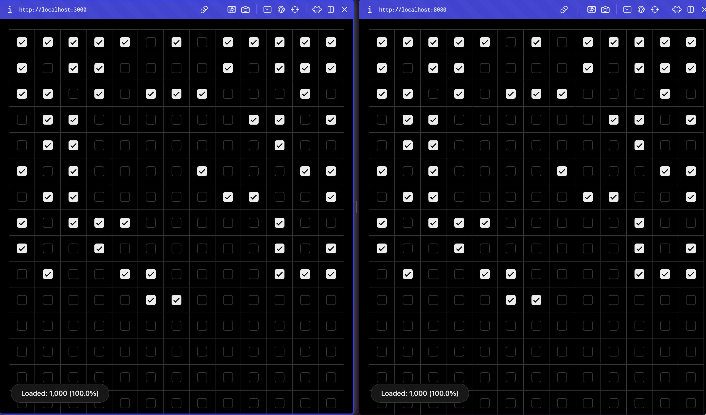

# 1 Million Checkboxes

<p align="center">
  
</p>

A high-performance, real-time web application featuring a shared grid of checkboxes that sync instantaneously across all users using **WebSockets**, backed by **Valkey/Redis** for state persistence and **Pub/Sub** for multi-instance horizontal scalability, and secured via **Google OIDC / OAuth 2.0**.

---

## Tech Stack

- **Frontend**: HTML, Vanilla CSS, JavaScript
- **Backend**: Node.js, Express, WebSockets (`socket.io`)
- **Database / Cache**: Valkey/Redis (`ioredis`)
- **Real-Time Cross-Node Synchronization**: `@socket.io/redis-adapter`
- **Authentication**: Google OAuth 2.0 / OIDC

---

## Features

- **High Performance**: Optimized, paginated rendering using Intersection Observer.
- **Horizontal Scaling Ready**: Synchronizes across multiple servers and ports perfectly using Redis Pub/Sub.
- **Real-Time Updates**: Checkboxes checked by any user sync instantly across all connected screens.
- **Persistent State**: The state of every checkbox is persisted in Redis.
- **Authentication Protected**: Anonymous users get read-only access. Authenticated users (logged in with Google) can check/uncheck boxes, triggering real-time toast notifications on everyone's screen.

---

## Prerequisites

- **Node.js** v18+
- **pnpm** or npm
- **Docker** (to run Valkey/Redis)

---

## Environment Variables

Create a `.env` file from the provided `.env.example` file:

```env
PORT=8080
SERVICE_NAME=1M_CHECKBOX
NODE_ENV=production

REDIS_HOST=localhost
REDIS_PORT=6379

OAUTH_CLIENT_ID=your_google_client_id
OAUTH_CLIENT_SECRET=your_google_client_secret
```

---

## How to Run Locally

### 1. Clone the repository
```bash
git clone https://github.com/TheSoumenMondal/1M-CHECKBOX.git
cd 1M-CHECKBOX
```

### 2. Run Redis
Make sure Docker is running and spin up Valkey/Redis:
```bash
docker compose up -d valkey
```

### 3. Install Dependencies
```bash
pnpm install
```

### 4. Start Development Mode
To start the app on port 8080:
```bash
pnpm dev
```

To run a second synchronized instance on port 3000:
```bash
PORT=3000 pnpm dev
```
